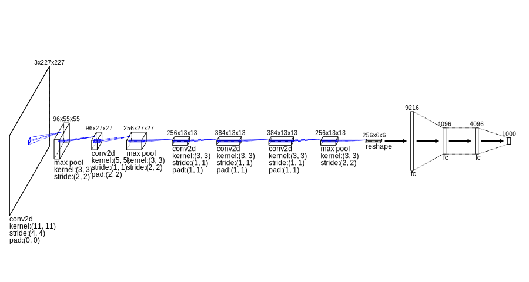

[](LICENSE)

# dnnsvg
[NNSVG](http://alexlenail.me/NN-SVG/) inspired network structure drawer for deep learning

# How to use
## Sample code

dnnsvg has intuitive interface which enables building svgs for common neural network architecture

```python
svg = SVGBuilder(height=height, width=width) \
    .add_layer(Convolution2D(in_channels=None, out_channels=96, ksize=11, stride=4)) \
    .add_layer(MaxPooling(ksize=3, stride=2)) \
    .add_layer(Convolution2D(in_channels=96, out_channels=256, ksize=5, stride=1, pad=2)) \
    .add_layer(MaxPooling(ksize=3, stride=2)) \
    .add_layer(Convolution2D(in_channels=256, out_channels=384, ksize=3, stride=1, pad=1)) \
    .add_layer(Convolution2D(in_channels=384, out_channels=384, ksize=3, stride=1, pad=1)) \
    .add_layer(Convolution2D(in_channels=384, out_channels=256, ksize=3, stride=1, pad=1)) \
    .add_layer(MaxPooling(ksize=3, stride=2)) \
    .add_layer(Reshape(output_shape=(1, 9216))) \
    .add_layer(FullyConnected(output_shape=(1, 4096))) \
    .add_layer(FullyConnected(output_shape=(1, 4096))) \
    .add_layer(FullyConnected(output_shape=(1, 1000))) \
    .build(input_tensor)
```

## Sample svg

### Alexnet svg sample




## To install the package

```bash
python setup.py install
```

or if you prefer using pip

```bash
pip install .
```

## When developing the package

It is recommended to use develop instead of install option to reflect changes in the directory

```bash
python setup.py develop
```

or if you prefer using pip

```bash
pip install -e .
```

